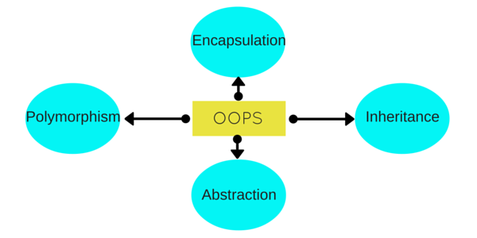
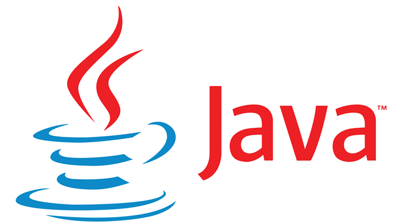
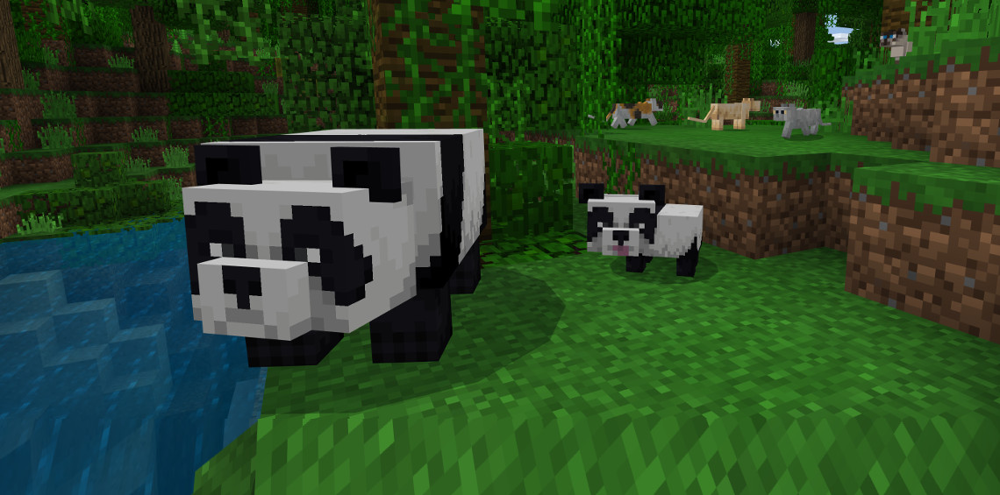
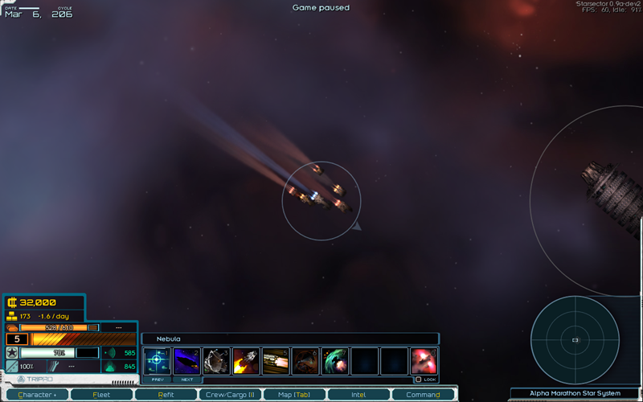
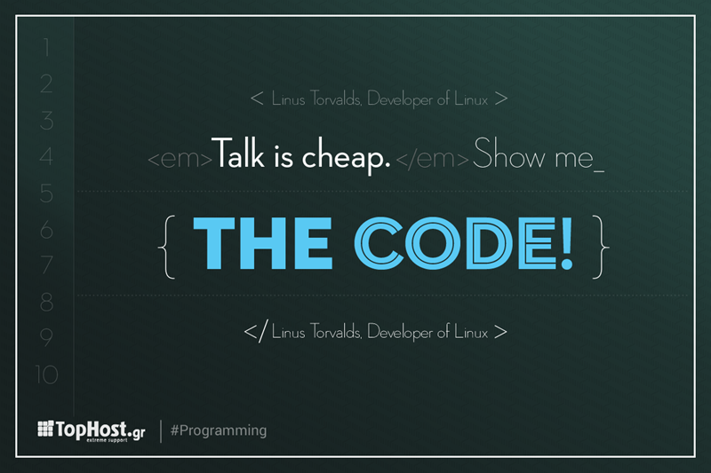
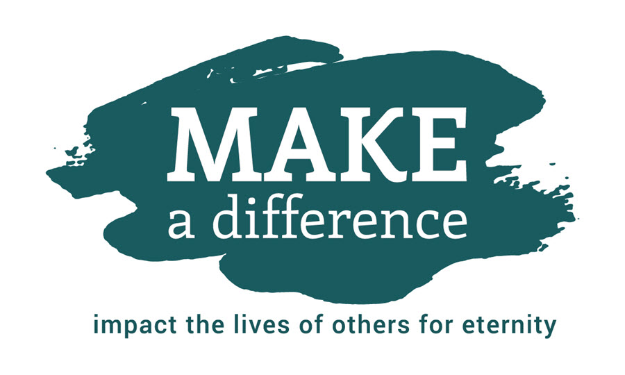
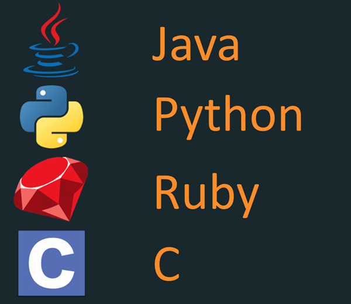

# Introduction


<small>Nathanael Yang</small>

<small>ny83427@gmail.com</small>

<small>https://www.javaneversleep.com</small>

---

### Object Oriented Programming


---

### In Java


---

### What Can Java Do?
- Almost everything
- Java IDEs Written in Java: [IDEA](https://github.com/JetBrains/intellij-community), [eclipse](https://git.eclipse.org/c/), [NetBeans](https://github.com/apache/incubator-netbeans)
- Web Application: J2EE, Spring Boot
- Mobile Application: J2ME, Android
- Big Data: Hadoop, HBase, Spark, Kafka...

---

### Even Games

---

### Even Games


---

### What Had I Do?
- JavaEE: UFIDA Seeyon, A8
- JavaEE: SAP, [ME/MII](https://www.youtube.com/watch?v=m3d90FYW6D4)
- JavaSE: IBPort, OrderMan/MailMan/WatchDog/WatchMan/Statistic Assistant/Octopus/ATongMu/Review Fisher...
- Personal: CoffeaBean, Jsoup Contributor

---

### Show Me The Code!


---

### Customers' Success, Your Success


---

## Encouragement
- Don't expect too much in short term: Overrated
- You can expect much in middle/long term: Underrated
- Just Do It! Day Day Up!
- Join a community, encourage and help each other
- A true story of mine

---

### Encouragement
Not everyone can be a great programmer, but everyone can be a programmer, and make a difference

---

### Brief History of Programming Languages
* [History of programming languages](https://en.wikipedia.org/wiki/History_of_programming_languages)
* [A Brief Totally Accurate History Of Programming Languages](https://medium.com/commitlog/a-brief-totally-accurate-history-of-programming-languages-cd93ec806124)
* [A Brief, Incomplete, and Mostly Wrong History of Programming Languages](http://james-iry.blogspot.com/2009/05/brief-incomplete-and-mostly-wrong.html?m=1)

---

### Brief History of Java
[James Gosling](https://en.wikipedia.org/wiki/James_Gosling)  


---

### Guess: Who Is Youngest?


---

### From 1.0 to 5.0
| Version| Release Date| Code Name|
|---|---|---|
| JDK Beta | 1995 | |
| JDK 1.0 | Jan, 1996 | |
| JDK 1.1 | Feb, 1997 | |
| J2SE 1.2 | Dec, 1998 | Playground |
| J2SE 1.3 | May, 2000 | Kestrel |
| J2SE 1.4 | Feb, 2002 | Merlin |
| J2SE 5.0 | Sep, 2004 | Tiger |

---

### From 6 to 12
| Version| Release Date| Code Name|
|---|---|---|
| Java SE 6 | Dec, 2006 | Mustang |
| Java SE 7 | July, 2011 | Dolphin |
| Java SE 8 | Mar, 2014 | Spider |
| Java SE 9 | Sep, 2017 | |
| Java SE 10 | Mar, 2018 | |
| Java SE 11 | Sep, 2018 | |
| Java SE 12 | Mar, 2019 | |
---

## Hello World
```java
public class HelloWorld {

    public static void main(String[] args) {
        System.out.println("Hello, World");
    }

}
```
[The Hello World Collection](http://helloworldcollection.de/)

---

## Write Once, Run Anywhere?
```cmd
:: Compile source code
javac HelloWorld.java

:: Execute byte code under Windows/Ubuntu/MacOS
java HelloWorld
```
* [OnceAnywhere](https://github.com/ny83427/java-tutorial-vagrant/blob/master/sample/OnceAnywhere.java): A Real life example
* Run Anywhere, not Wrong Any where

---

## Follow Up
* Type `javad HelloWorld.java` and execute, what will happen?
* If you have installed multiple versions of Java, for example, Java 8 and 11, how do you know
which [version](https://en.wikipedia.org/wiki/Java_class_file) you are using to compile the source code?
* Run HelloWorld under Ubuntu without compiling and with compiling

---

## Assignments
* Install JDK8 and write your first `HelloWorld`
* Setup development environment: JDK11/Git/IDEA Community/everything/notepad++/vscode
* Using notepad++/vscode/IDEA to write `HelloWorld` and run it
* Download [Demos and Samples](https://www.oracle.com/technetwork/java/javase/downloads/jdk8-downloads-2133151.html) and Play

---

## Challenges
* Setup development environment repeatedly is boring, can you [automate](https://gist.github.com/ny83427/4ca8801fb340bb0555e63155a7050ee9) it?
* Install JDK8/IDEA in a different system and `HelloWorld`
* Write a Fibonacci number calclator `Fibonacci.java`

---

## Challenges
* F20 = 6765, how about F100 and how long your method will take to finish?
* Can you resolve Fibonacci number without recursion?
* What will happen for F10000?
* Check details in [GitHub](https://github.com/ny83427/java-tutorial/blob/master/chapter1/assignments.md)

---

## [The End: Happy Coding!](https://t.co/KUO8i66Rzm)
